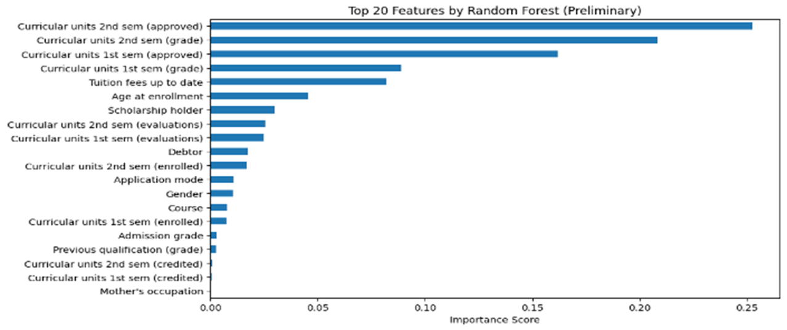

# Student-Dropout-Prediction-ML

This project develops a machine learning framework to predict student dropout risk in higher education institutions using structured academic, demographic, and financial data. The task is formulated as a binary classification problem distinguishing between *Dropout* and *Graduate* outcomes.

---

## Dataset

- **Source:** UCI Machine Learning Repository  
- **Records after preprocessing:** 3,630 students  
- **Target variable:**  
  - Dropout → 0  
  - Graduate → 1  

Students labeled as *Enrolled* were excluded to avoid outcome ambiguity, leaving only finalized academic outcomes.

---

## Modeling Strategy 

Six supervised learning models were implemented and evaluated:

- Logistic Regression (baseline)
- Decision Tree
- Random Forest
- Gradient Boosting
- XGBoost
- LightGBM

After initial comparison, hyperparameter tuning was applied to the top-performing ensemble models:
- Random Forest
- Gradient Boosting
- LightGBM

A Stacking Classifier was then constructed using the tuned ensemble models as base learners, with Logistic Regression as the meta-learner.

---

## Feature Selection

Feature selection was guided by:
- Correlation analysis 
- Random Forest feature importance

The most influential predictors consistently included:
- Curricular units (1st and 2nd semester grades & approvals)
- Tuition fee payment status
- Admission grade
- Age at enrollment

These features align with known academic risk factors and support model interpretability.
Random Forest feature importance confirms academic performance and financial indicators as dominant predictors.

---

## Results Summary

| Model | Accuracy | Precision | Recall | F1-Score | ROC-AUC |
|-----|----------|-----------|--------|----------|--------|
| Logistic Regression | 0.892 | 0.878 | 0.955 | 0.915 | 0.928 |
| Random Forest | 0.895 | 0.888 | 0.949 | 0.917 | 0.937 |
| Gradient Boosting | 0.900 | 0.897 | 0.946 | 0.920 | 0.943 |
| XGBoost | 0.888 | 0.889 | 0.933 | 0.911 | 0.931 |
| LightGBM | 0.897 | 0.892 | 0.945 | 0.918 | 0.934 |
| **Gradient Boosting (Tuned)** | **0.903** | **0.896** | **0.950** | **0.922** | **0.943** |
| **Stacking Classifier** | 0.901 | 0.897 | 0.946 | 0.921 | **0.943** |

---

## Why Gradient Boosting and Stacking Perform Best

- **Gradient Boosting (Tuned)** achieved the highest overall accuracy and one of the strongest ROC-AUC scores, indicating robust generalization.
- **Stacking** closely matched Gradient Boosting’s ROC-AUC while maintaining balanced precision and recall.
- Train vs cross-validation metrics show **no significant overfitting**, especially for tuned Gradient Boosting and the Stacking Classifier.

These results demonstrate the effectiveness of **ensemble learning** for capturing complex relationships in educational data.

---

## Key Takeaways

- Academic performance in early semesters is the strongest indicator of student success.
- Financial factors (tuition payment status, debtor status) significantly influence dropout risk.
- Ensemble models outperform simpler classifiers in both accuracy and ROC-AUC.
- **Tuned Gradient Boosting** provides the best overall performance.
- The framework is suitable for **early risk identification** and data-driven student retention strategies.

---

## Note

This project was developed as part of my Master of Data Science program, within the
Predictive Analytics for Business course.

## Contact
For any questions, please contact me:

- [LinkedIn](https://www.linkedin.com/in/mashael-alsogair-97b754230/)

Thank you!
